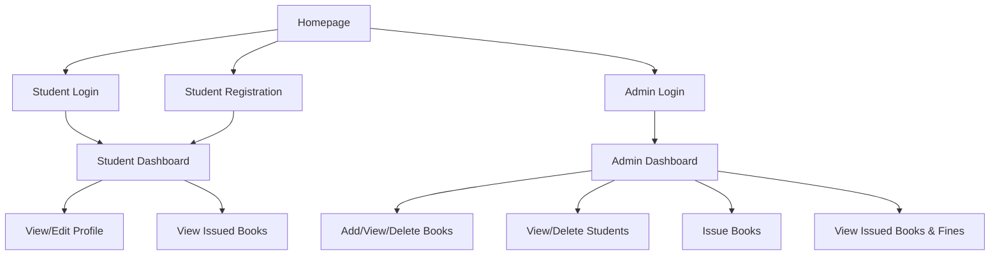

# Django Online Library Management System 📚

## 🚀 Overview

The **Django Online Library Management System** is a robust web application designed to streamline and automate the management of library operations, including handling student registrations, book management, book issuing/returning, and user authentication. Built using Django, HTML, CSS, and Bootstrap, this solution enables both students and administrators to efficiently manage library records and activities.

---

## 🏗️ Features

### 👩‍💼 For Admin
- Add new books to the library
- View, list, and delete books
- View and delete registered students
- Issue books to students and manage issued books
- View all issued books with fine calculations (Rs 5/day after 14 days)

### 👨‍🎓 For Students
- Register and log in
- View and edit profile details
- Change their password
- View books issued to them with due dates and fines

---

## 🛠️ Project Prerequisites

To use or contribute to this project, you should be familiar with:
- **Python** (3.8+)
- **Django** (3.1+)
- **HTML, CSS, Bootstrap**

---

## 📋 How It Works

- **Homepage:** Options for student registration, student login, and admin login.
- **Student Registration:** Students can register with their details.
- **Admin Operations:** 
  - Admin can add/delete books and manage students.
  - Issue books to students and track issued/returned books.
  - View all registered students and issued books.
  - Calculate and display fines for overdue books.
- **Student Operations:**
  - Students can view and edit their profiles.
  - See a list of books issued to them.
  - Change password and update selected profile details.

---

## 🔄 Complete Working Flow

This section explains how different parts of the system interact to deliver a seamless library management experience.

### 1. **User Interfaces**

- **Homepage (`index.html`):**  
  Presents three primary entry points:  
  - Student Registration  
  - Student Login  
  - Admin Login  

- **Registration and Login:**  
  - Students register via a form (`student_registration.html`), which creates a user and a student profile in the database.
  - Admins log in via a dedicated form (`admin_login.html`). Admins have elevated privileges.

### 2. **Authentication & Authorization**

- Django’s built-in authentication system manages user sessions.
- Views are protected with decorators (e.g., `@login_required`) to ensure only logged-in users can access certain pages.
- Admin and student dashboards are separated by user roles.

### 3. **Admin Panel Functionalities**

- **Add/View/Delete Books:**  
  - Admin can add new books through a form (`add_book.html`).  
  - All books are displayed in a table (`view_books.html`), with options to delete.
- **Manage Students:**  
  - Admin can view and delete students.
- **Issue Books:**  
  - Admin selects a student and a book, then issues the book.  
  - Issued book records are tracked (`IssuedBook` model).
- **Track Issued Books and Fines:**  
  - List of all issued books is shown (`view_issued_book.html`).  
  - The system automatically calculates fines for overdue books.

### 4. **Student Functionalities**

- **Profile Management:**  
  - Students can view and edit their profiles.
- **Issued Books:**  
  - Students see a list of books issued to them (`student_issued_books.html`), including due dates and any fines.

### 5. **Database Models**

- **Book:** Stores book details (name, author, ISBN, category).
- **Student:** Stores student information and links to the User model.
- **IssuedBook:** Records which books have been issued to which students, along with issue and expiry dates.

### 6. **Static & Media Files**

- **Static files** (CSS, JS, images) are managed using Django’s static files settings.
- **Media files** (e.g., profile pictures) are stored in a dedicated directory.

### 7. **Flow Summary**



_All interactions are managed via Django views, templates, and models, with proper user authentication and session management._

---

## 🖥️ Tech Stack

- **Backend:** Django (Python)
- **Frontend:** HTML, CSS, Bootstrap
- **Database:** SQLite (default, customizable in settings)

---

## ⚙️ Setup & Installation

1. **Clone the Repository**
   ```bash
   git clone https://github.com/unknownw66/DJANGO-PRJ.git
   cd library-management-system
   ```

2. **Create a Virtual Environment**
   ```bash
   python -m venv venv
   source venv/bin/activate  # On Windows: venv\Scripts\activate
   ```

3. **Install Dependencies**
   ```bash
   pip install -r requirements.txt
   ```

4. **Configure Environment Variables**
   - Create a `.env` file with your Django secrets (see `settings.py` for required variables).

5. **Apply Migrations**
   ```bash
   python manage.py migrate
   ```

6. **Run the Development Server**
   ```bash
   python manage.py runserver
   ```

7. **Access the Application**
   - Visit `http://127.0.0.1:8000/` in your browser
---
## 🙋‍♂️ Author & Portfolio
RAJATH S
rajaths091@gmail.com
---
# DJANGO-PRJ
